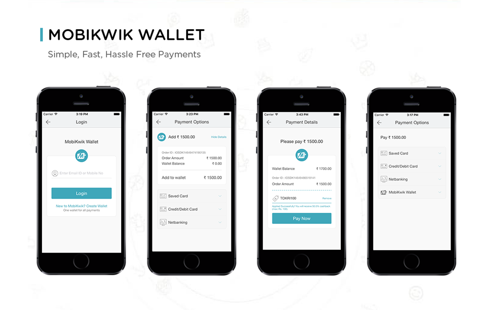

MobiKwik iOS SDK is a ready to use native solution for iOS applications (iOS 7 and above) to start accepting payments. This SDK provides both, fully functional user interface and API based methods for merchants who want to use their own interface.


## Payment Options

Based on requirements, merchants can choose from the following list of payment methods that are supported by SDK:
- MobiKwik Wallet Payments
- Card Payments
- Saved Cards
- Net Banking

>### Note
> All payment methods except MobiKwik Wallet, provide both UI and Non-UI functions. MobiKwik Wallet requires detailed user authorisation hence it contains it’s own UI.


## Prerequisites
Before starting with client integration process for your iOS application, please make sure that following steps and requirements have been met.
- **Merchant Identifier :** All MobiKwik merchants are provided with a unique merchant id e.g. MBK9002. You can find your merchant id and secret key in your MobiKwik [merchant account](https://wallet.mobikwik.com).
 
- **Merchant Checksum URL :** All network calls from SDK are checksum protected. This checksum is calculated by merchant server with a secret key which is available in your MobiKwik merchant account.

- **Merchant Response URL :** MobiKwik notifies merchant server at this URL regarding transaction’s state. This URL is also used for card, saved cards and netbanking payment methods.


## Integration

###Add SDK to Project

MobiKwik SDK is available through [CocoaPods](http://cocoapods.org). To install
it, simply add the following line to your Podfile:

```ruby
pod 'MobiKwik SDK', '~> 2.0'
```

If you have enabled Bitcode in your project, you need to add following line in your Podfile:

```ruby
pod 'Bitcode/MobiKwik SDK', '~> 2.0'
```

If you are not using CocoaPods in your project, download the required MobiKwik `.framework` file from this GitHub page. Drag & drop the framework in your project. Make sure that you check the option `Copy items if needed`.

###Initiate Payment Engine

All the payment requests and responses are handled by class `MKSDKPaymentEngine` and its delegate methods. Create an instance of payment engine class which resides in memory till transaction lasts.

```obj-c
#import <MobiKwikSDK/MobiKwikSDK.h>

@interface CheckoutPageVC ()<MKSDKPaymentDelegate>
@property MKSDKPaymentEngine *MBKSDKInstance;
@end

- (void)viewDidLoad
{
    [super viewDidLoad];
    // Do any additional setup after loading the view.
    self.MBKSDKInstance = [[MKSDKPaymentEngine alloc] init];
   [self.MBKSDKInstance setDelegate:self];
```

####Delegates
All the responses of the transaction will be provided by SDK in respective delegate methods.
```obj-c
#pragma mark - MobiKwik SDK Delegates

-(void)mksdkPaymentSucceeded:(MKSDKPaymentInfo *)payment
{
    //Payment SUCCESS
}

-(void)mksdkPaymentFailed:(MKSDKPaymentInfo *)payment withError:(NSError *)failError
{
    //Payment FAILED with error. Status code is error.code , failure description is failError.localizedDescription
}

-(void)mksdkPaymentInitiated:(MKSDKPaymentInfo *)payment inWebview:(UIWebView *)webview
{
    //Payment started re-directing to bank page in webview.
}

-(void)mksdkPaymentHitTimeOut
{
    //Payment HIT TIMEOUT
}

-(void)mksdkPaymentWebpageStartedLoading
{
    //Webpage Started Loading
}

-(void)mksdkPaymentWebpageStoppedLoading
{
    //Webpage Stopped Loading
}

```

 - **mksdkPaymentSucceeded :** Transaction got completed successfully.

 - **mksdkPaymentFailed :** Transaction failed because of an error failError. Status code is present in code property of failError object and reason for failure in localizedDescription property.
 
 - **mksdkPaymentInitiated :** When using your own UI, SDK will provide you with an UIWebView object running bank redirects. Merchants can use this webview in their own UI.
 
 - **mksdkPaymentHitTimeOut :** While using your own UI, SDK notifies merchant with this delegate that a bank page is taking time to load. You can ask to either wait for it to load or cancel transaction.
 
 - **mksdkPaymentWebpageStartedLoading :** While using your own UI, SDK notifies merchant that a bank page has started to load in provided UIWebView object.
 
 - **mksdkPaymentWebpageStoppedLoading :** While using your own UI, SDK notifies merchant that a bank page has stopped loading in provided UIWebView object.


####Start Transaction
`MKSDKPaymentEngine` class provide different methods for different payment flows. Merchants can choose payment flows according to their requirements. SDK provides all the payment modes (except MobiKwik Wallet) with UI and without UI support. To initiate any chosen payment flow, call required method from `MKSDKPaymentEngine` object in your final pay button action. Find more details regarding payment methods and `MKSDKPaymentInfo` object in Integration Document present in this repo.


## Support
For any query, issue and integration support, please contact technical support at techops@mobikwik.com.

## Author
Akashdeep, akashdeep@mobikwik.com


## License

TestCocoaPod is available under the MIT license. See the LICENSE file for more info.
